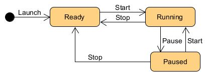

# Stopwatch
A desktop Stopwatch application made with WPF

## Requirements
Develop a stopwatch, using WPF, C# and SOLID principles, displaying "hours::minutes::seconds" with 3 buttons:
- Start: to start the stopwatch.
- Pause: to pause the stopwatch.
- Stop: to stop de stopwatch and reset the counter.

Note: The usage of a dependency inyection framework for DI principle is not mandatory.

## State machine
Following is the state machine of the stopwatch application:

## Behavior
As it has not been required, when counter reach 23::59::59 it will go back to 00::00:00 to continue counting, instead of counting days or laps.

## License

This application is licensed under the [MIT License](https://github.com/JAFS6/Stopwatch/blob/main/LICENSE).

## Author

[Juan Antonio Fajardo Serrano](https://www.linkedin.com/in/jafs6)
